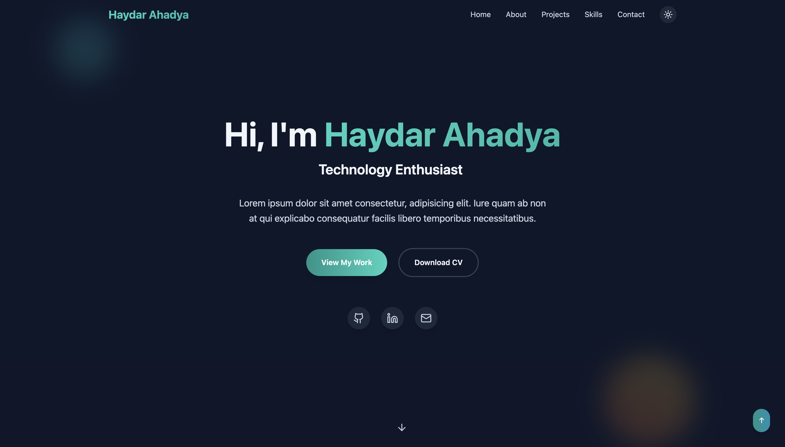

# Template Portfolio

Template portfolio modern yang dibangun dengan React, TypeScript, dan Vite. Desain responsif dengan Tailwind CSS untuk menampilkan proyek dan keterampilan Anda dengan profesional.



## 🚀 Fitur

- ⚡ **Vite** - Build tool yang cepat dan modern
- ⚛️ **React 18** - Library UI terdepan
- 🏷️ **TypeScript** - Type safety untuk JavaScript
- 🎨 **Tailwind CSS** - Utility-first CSS framework
- 📱 **Responsive Design** - Tampilan optimal di semua perangkat
- 🛠️ **ESLint** - Code linting untuk kualitas kode
- 🔧 **PostCSS** - Tool untuk transformasi CSS

## 📁 Struktur Proyek

```
Template-Portfolio/
├── eslint.config.js      # Konfigurasi ESLint
├── index.html           # Entry point HTML
├── package.json         # Dependencies dan scripts
├── postcss.config.js    # Konfigurasi PostCSS
├── src/
│   ├── App.tsx         # Komponen utama aplikasi
│   ├── components/     # Komponen React yang dapat digunakan kembali
│   ├── index.css       # Styles global dan Tailwind imports
│   ├── main.tsx        # Entry point aplikasi React
│   └── vite-env.d.ts   # Type definitions untuk Vite
├── tailwind.config.js   # Konfigurasi Tailwind CSS
├── tsconfig.json        # Konfigurasi TypeScript
├── tsconfig.app.json    # Konfigurasi TypeScript untuk aplikasi
├── tsconfig.node.json   # Konfigurasi TypeScript untuk Node.js
└── vite.config.ts       # Konfigurasi Vite
```

## 🛠️ Installation

1. **Clone repository**
   ```bash
   git clone https://github.com/username/Template-Portfolio.git
   cd Template-Portfolio
   ```

2. **Install dependencies**
   ```bash
   npm install
   ```

3. **Jalankan development server**
   ```bash
   npm run dev
   ```

4. **Buka browser** dan akses `http://localhost:5173`

## 📜 Available Scripts

- `npm run dev` - Menjalankan development server
- `npm run build` - Build aplikasi untuk production
- `npm run preview` - Preview build production secara lokal
- `npm run lint` - Menjalankan ESLint untuk check kode

## 🎨 Kustomisasi

### Tailwind CSS
Sesuaikan tema dan styling di `tailwind.config.js`:
```javascript
module.exports = {
  theme: {
    extend: {
      colors: {
        // Tambahkan warna custom
      },
      fontFamily: {
        // Tambahkan font custom
      }
    }
  }
}
```

### Komponen
Tambahkan komponen baru di folder `src/components/` dan import ke `App.tsx`.

## 📦 Build Production

Untuk membuat build production:
```bash
npm run build
```

File hasil build akan tersimpan di folder `dist/` dan siap untuk di-host di server web apapun.

## 🤝 Contributing

1. Fork repository
2. Buat feature branch: `git checkout -b feature/amazing-feature`
3. Commit perubahan: `git commit -m 'Add amazing feature'`
4. Push ke branch: `git push origin feature/amazing-feature`
5. Buat Pull Request

## 📄 License

Distributed under the MIT License. See `LICENSE` for more information.

## 📞 Contact

Your Name - [your.email@example.com](mailto:your.email@example.com)

Project Link: [https://github.com/username/Template-Portfolio](https://github.com/username/Template-Portfolio)

---

⭐ Jangan lupa berikan star jika project ini membantu Anda!